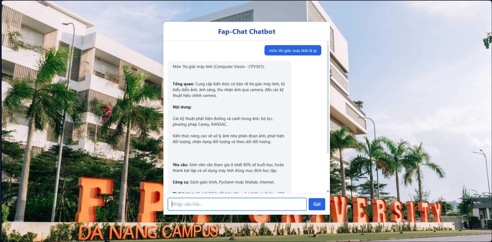

# FAP Chat - Student Academic Data RAG System

Hệ thống RAG (Retrieval-Augmented Generation) cho dữ liệu học tập sinh viên FPT University.


## 🚀 Cài đặt

### 1. Cài đặt dependencies
```bash
pip install -r requirements.txt
```

### 2. Cấu hình Environment Variables
Tạo file `.env` trong thư mục gốc với các biến sau:

```env
# Qdrant Vector Database
QDRANT_URL=https://your-qdrant-url.qdrant.io:6333
QDRANT_API_KEY=your_qdrant_api_key_here
QDRANT_COLLECTION=Fap_data_testing

# MySQL Database (Aiven)
MYSQL_HOST=your-mysql-host.aivencloud.com
MYSQL_PORT=19116
MYSQL_USER=your_mysql_username
MYSQL_PASSWORD=your_mysql_password
MYSQL_DB=your_database_name

# LLM (Gemini) - Optional
GEMINI_API_KEY=your_gemini_api_key_here
```

## 🎯 Sử dụng

### Chạy hệ thống chính
```bash
cd Fap_Chat/code
python main.py
```

### Các tính năng chính:

1. **Cào dữ liệu từ FAP** (tùy chọn)
   - Nhập email và mật khẩu FPT
   - Tự động cào: profile, điểm danh, điểm số, tổng kết môn học

2. **Đồng bộ với Cloud Database**
   - Upload dữ liệu lên MySQL Aiven
   - Download dữ liệu về local

3. **Vector Embedding & Search**
   - Tạo embeddings cho dữ liệu
   - Tìm kiếm semantic với BGE-M3
   - Hỗ trợ time range filtering

4. **LLM Enhancement** (tùy chọn)
   - Intent extraction
   - Re-ranking kết quả
   - Tổng hợp câu trả lời

## 🔍 Ví dụ truy vấn

### Time Range Queries:
- `"điểm danh tuần sau"`
- `"lịch học tháng này"`
- `"điểm danh kì sau"`
- `"lịch học kì trước"`

### Subject Queries:
- `"điểm môn CPV301"`
- `"điểm danh môn AIL303m"`
- `"thông tin sinh viên"`

### Combined Queries:
- `"điểm danh môn CSI105 tuần sau"`
- `"điểm môn PFP191 kì này"`

## 📁 Cấu trúc Project

```
Fap_Chat/
├── code/
│   ├── main.py              # Entry point
│   │   ├── FAP/
│   │   │   ├── embedder.py      # Vector search engine
│   │   │   ├── llm_helper.py    # LLM integration
│   │   │   ├── cloud.py         # Database management
│   │   │   └── fap_scraper.py   # Data scraping
│   │   └── data/
│   │       └── FAP/             # CSV data files
│   └── requirements.txt
└── README.md
```

## ⚠️ Lưu ý

1. **Bảo mật**: Đảm bảo file `.env` không được commit lên git
2. **Dependencies**: Cần cài đặt đầy đủ các thư viện trong requirements.txt
3. **API Keys**: Cần có Qdrant và MySQL credentials hợp lệ
4. **LLM**: Gemini API key là tùy chọn, hệ thống vẫn hoạt động không có LLM

## 🐛 Troubleshooting

### Lỗi kết nối database:
- Kiểm tra thông tin MySQL trong `.env`
- Đảm bảo database đã được tạo

### Lỗi Qdrant:
- Kiểm tra QDRANT_URL và QDRANT_API_KEY
- Đảm bảo collection có thể tạo được

### Lỗi LLM:
- Kiểm tra GEMINI_API_KEY
- Hệ thống sẽ fallback về search truyền thống nếu LLM không khả dụng
